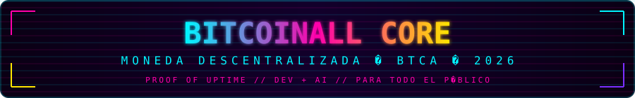
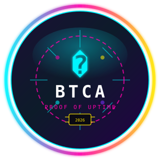
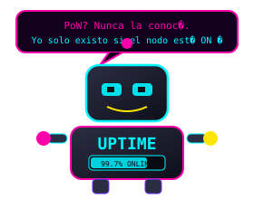
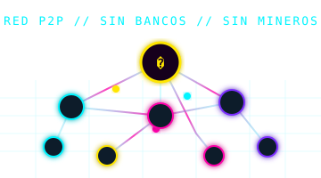
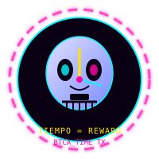
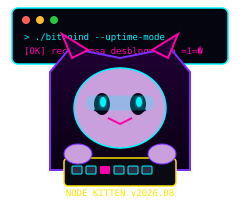
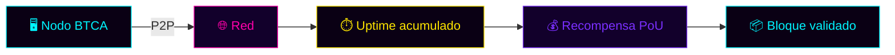

  

  

  <strong>Moneda descentralizada para todo el público</strong> 
  <a href="https://github.com/gonzalolinaresamezcua/BitcoinAll">github.com/gonzalolinaresamezcua/BitcoinAll</a> · <em>Proof of Uptime</em> · <em>Dev + AI</em> · 2026

  
  
  
  

---

<table>
<tr>
<td width="33%" align="center">

 <b>PoW desactivado.</b> Aquí premiamos uptime, no GPUs fundidas.
</td>
<td width="33%" align="center">

 Nodos conectados. Sin bancos. Sin intermediarios.
</td>
<td width="33%" align="center">

 Tiempo online = recompensa. <code>BTCA_TIME</code> en acción.
</td>
</tr>
</table>

  

> **Repositorio oficial:** [github.com/gonzalolinaresamezcua/BitcoinAll](https://github.com/gonzalolinaresamezcua/BitcoinAll)  
> **Instalación:** compila desde el código ([doc/build-unix.md](doc/build-unix.md)) o revisa [Releases](https://github.com/gonzalolinaresamezcua/BitcoinAll/releases).  
> *El gato no mina. El gato permanece conectado. El gato gana.*

---

## Descarga e instalación

BitcoinAll **no tiene web de descarga propia**. El único sitio oficial del proyecto es este repositorio en GitHub.

| Opción | Enlace |
|--------|--------|
| **Compilar en Linux** | [doc/build-unix.md](doc/build-unix.md) |
| **Releases (binarios)** | [github.com/gonzalolinaresamezcua/BitcoinAll/releases](https://github.com/gonzalolinaresamezcua/BitcoinAll/releases) |
| **Issues y soporte** | [github.com/gonzalolinaresamezcua/BitcoinAll/issues](https://github.com/gonzalolinaresamezcua/BitcoinAll/issues) |

No uses enlaces tipo `@bitcoinall/en/download/` ni dominios de terceros: no pertenecen a este proyecto.

## ¿Qué es BitcoinAll Core?

BitcoinAll Core se conecta a la red peer-to-peer de BitcoinAll para descargar y validar completamente bloques y transacciones. Incluye wallet e interfaz gráfica (compilación opcional).

---

## Consenso · Proof of Uptime (PoU)

BitcoinAll usa **Proof of Uptime (PoU)**. En lugar de minería proof-of-work, la participación y las recompensas de bloque están ligadas al **tiempo de conexión acumulado** del nodo en la red.

| Concepto | Detalle |
|----------|---------|
| **Ticker** | `BTCA` |
| **Mecanismo** | Uptime de nodo, no hashrate |
| **TX especial** | `BTCA_TIME` — marca tiempo online |
| **PoW** | Desactivado (RIP ASICs, 2009–2026 💀) |
| **Parámetros** | `src/consensus/params.h` |

  

Más información en la [carpeta doc](/doc).

---

## Licencia

BitcoinAll Core se distribuye bajo la licencia **MIT**.

Copyright (c) 2025-2026 Bitcoin All Developers. Ver [COPYING](COPYING) o https://opensource.org/licenses/MIT.

---

## Proceso de desarrollo

La rama `master` se compila y prueba regularmente (ver `doc/build-*.md`), pero no está garantizada como completamente estable. Las [releases](https://github.com/gonzalolinaresamezcua/BitcoinAll/releases) marcan versiones estables.

Repositorio oficial: https://github.com/gonzalolinaresamezcua/BitcoinAll

Flujo de contribución: [CONTRIBUTING.md](CONTRIBUTING.md) · Notas para devs: [doc/developer-notes.md](doc/developer-notes.md).

---

## Testing

El cuello de botella del desarrollo es la revisión y las pruebas. Sé paciente y ayuda probando PRs de otros — esto es software crítico para seguridad financiera.

### Tests automatizados

- **Unit tests:** [src/test/README.md](src/test/README.md) — ejecutar con `ctest`
- **Funcionales / integración:** [test/](/test) — `build/test/functional/test_runner.py`
- **CI:** compila en Windows, Linux y macOS en cada PR

### QA manual

Cambios grandes o de alto riesgo deben probarse por alguien distinto al autor. Incluye un plan de pruebas en la descripción del PR si no es trivial.

---

## Traducciones

Las traducciones se gestionan en el repositorio. Abre un issue o pull request en [GitHub](https://github.com/gonzalolinaresamezcua/BitcoinAll) si quieres colaborar.

---

  

  
    <code>// BITCOINALL :: BTCA :: UPTIME &gt; HASHRATE :: 2026 //</code> 
    Hecho con neón, café y nodos que no se desconectan.
  

